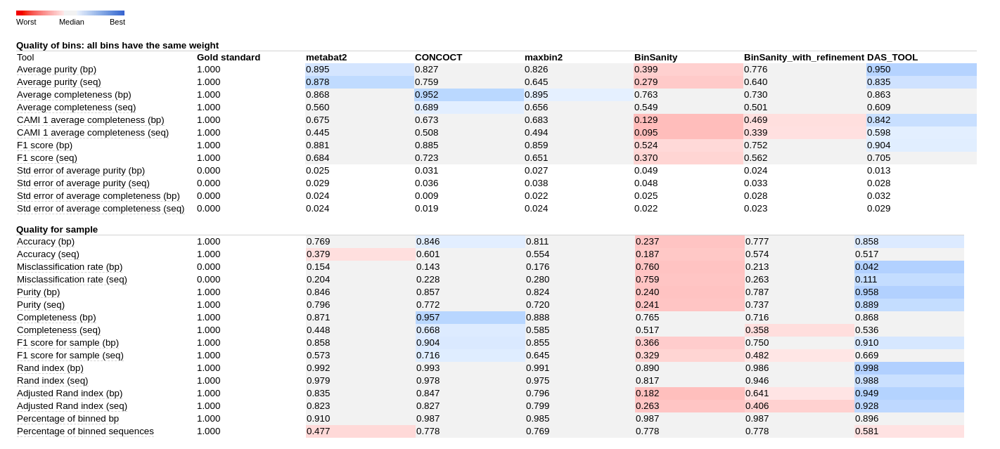

# improvingGraphBin2
Bioinformatics Institute Autumn 2020 Project: Improving binning of metagenomic data.

## Purpose and objectives of the project
### Purpose
Purpose of the project was to explore label propagation algorithm for metagenomic binning which is used in GraphBin2 and to make an attempt to improve this approach.

### Objectives
1. Explore workflow of [GraphBin2 binning tool](https://github.com/Vini2/GraphBin2)
2. Gather binning statistics including detailed information about intermediate binning results from GraphBin2.
3. Identify advantages and disadvantages of GraphBin2.
4. Make an attempt to improve GraphBin2.

### Future development
Obtained data may help to implement efficient binning algorithm with usage of SPAdes API.

## List of programs used in project
* We developed improved version of GraphBin2 (which works with SPAdes assemblies)

### Binning evaluation
* Minimap2 as a part of [metaquast](https://github.com/ablab/quast) (gold standart file creation)
* [Amber](https://github.com/CAMI-challenge/AMBER) (binning benchmark)

### Binners
* [Metabat2](https://bitbucket.org/berkeleylab/metabat/src/master/) 
* [CONCOCT](https://github.com/BinPro/CONCOCT)
* [MaxBin2](https://sourceforge.net/projects/maxbin2/)
* [BinSanity](https://github.com/edgraham/BinSanity)
* [DAS_tool](https://github.com/cmks/DAS_Tool)
* [GraphBin2](https://github.com/Vini2/GraphBin2)

### Accessory tools
* convert_bins.py (binning files manipulation)
* compare_binnings.py (basic binning comparison)

## Installation
### Dependencies
* python>=3.7.1
* biopython>=1.72
* python-igraph>=0.7.1
* tqdm
* pandas>=1.1.14

### Installation using conda
```bash
git clone https://github.com/GinGin3203/improvingGraphBin2.git GraphBin2_improved
conda env create environment.yml
conda activate graphbin2
```

## Usage
### GraphBin2_improved general usage
...

### Binning benchmarking
Benchmarking is performed using **Amber** and it's accessory utilities.

All files passed to *amber.py* must satisfy requirements of [CAMI binning Bioboxes format](https://github.com/bioboxes/rfc/tree/master/data-format).
<hr>
To create single binning file which satisfies this format from multiple files representing each bin (common case for many binners output) you can use *convert_fasta_bins_to_biobox_format.py* utility.

```bash
python convert_fasta_bins_to_biobox_format.py * -o bins.tsv
```

Location of this script should be ".../site-packages/src/utils/".
<hr>
To add biobox format header to existing binning file you can run:

```bash
convert_bins.py --insep "\t" --outsep "\t" --biobox-header \
 --sample-id SAMPLEID bins.tsv > bins_with_biobox_header.tsv
```
*convert_bins.py may be also used for delimiter change, contig names stripping, removing of multiple-binned contigs.*
Check convert_bins.py -h for more information. 
<hr>

You also need a *gold standart* file for evaluation using *Amber*. This file contains perfect binning of dataset and can be obtained by aligning assembly to references. To achieve this we used *metaquast.py*.

```bash
metaquast.py -o quast_results_scaffolds_0.8 -r dir_with_references -t 16 \
 -u --fragmented -m 0 --min-identity 80.0 scaffolds.fasta
```

Then we need to extract contig mapping from minimap output.
```bash
cd quast_results_scaffolds_0.8/combined_reference/contigs_reports/minimap_output/

cut -d " " -f 12,13 scaffolds.coords.filtered | sort -u | sed -r "s/(.+) (.+)/\2\t\1/g" > gold_standart_raw.tsv
```
The last step is to add column containing length of contigs.
```bash
python add_length_column.py -g gold_standart_raw.tsv -f scaffolds.fasta > gold_standart.tsv
```
Location of this script should be “…/site-packages/src/utils/”.
<hr>
Ensure that contig names format in gold standart match contig names format in files with bins. BINID field format may be different among files.

Now everything is ready for benchmarking. Run *amber.py* as follows:
```bash
amber.py -o output_report_dir \
         -g gold_standart.tsv \
         -l binning1_label,binning2_label,binning3_label \
         binning1.tsv binning2.tsv binning3.tsv
```
Output directory contains detailed HTML report. For the most cases we used metrics heatmap to compare binnings.

